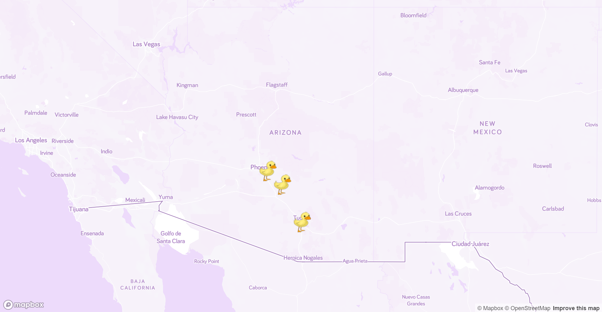

# Lucky Duck

## Description
A MERN stack single-page application that works with real-world data to solve a real-world challenge, with a focus on data and user demand. This project provides the best opportunity to demonstrate problem-solving skills. Technologies include: Performant JavaScript, NoSQL databases, React single-page application, GraphQL APIs, Concurrent servers with a MERN app, and Authentication (JWT)

## Tasks Completed
* Used React for the Front End. 
* Used GraphQL with a Node.js and Express.js server.
* Used MondoDB and the Mongoose ODM for the database.
* Used queries and mutations for retrieving, adding, updating, and deleting data.
* Deployed with Heroku (with data).
* Responsive
* Included Authentication (JWT).
* Protect sensitive API key information on the server. 
* Interactive with user input. 

## About the Webpage
Its a find my pet application that allows you to drop a pin on a map of where you might have lost your pet. Allows users to create an account, add their pets to their profile. Also allows other users to comment, obtain contact information and communicate with owner of lost pet. 
  
## Contributors
* [Carl Bush](https://github.com/CarlBush)
* [Madison Milner](https://github.com/mmilner29)
* [Rodrigo Valencia](https://github.com/Rodrigo-Valencia)

### Links
* [Github Link](https://github.com/CarlBush/Lucky-Duck)
* [Deployed Link](https://scenic-great-basin-78312.herokuapp.com/)

### Reference 
